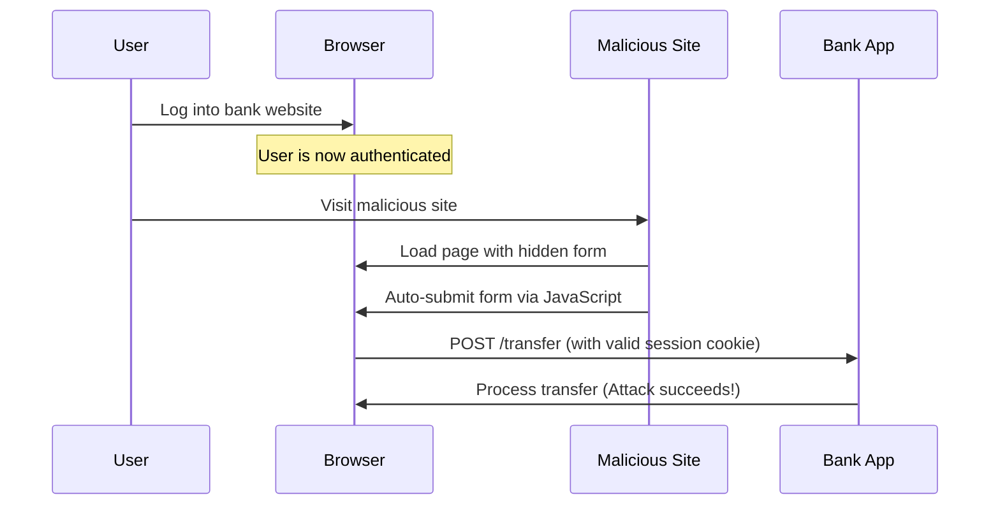
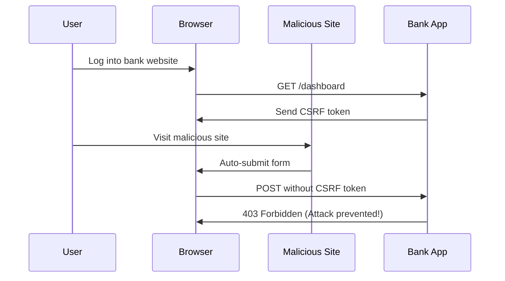

# Cross-Site Request Forgery (CSRF) Protection Demo

## What is CSRF?
Cross-Site Request Forgery (CSRF) is an attack that forces authenticated users to submit unwanted requests to a web application where they're currently logged in. The attack leverages the user's authenticated session to perform unauthorized actions.

## Key Security Features

### CSRF Protection Mechanisms
1. **Token Generation**
   - Cryptographically strong random tokens
   - Unique per session
   - Cannot be predicted by attackers

2. **Token Storage**
   - Server-side validation
   - Client-side storage in cookies
   - Synchronized tokens pattern

3. **Validation Process**
   - Token presence check
   - Token matching validation
   - Session association

## Architecture Overview

### Attack Scenario Without CSRF Protection


### CSRF Protection Workflow


## Security Configuration

### Spring Security CSRF Protection
```java
CsrfTokenRequestAttributeHandler requestHandler = new CsrfTokenRequestAttributeHandler();
CookieCsrfTokenRepository tokenRepository = CookieCsrfTokenRepository.withHttpOnlyFalse();
tokenRepository.setCookieName("XSRF-TOKEN");
tokenRepository.setHeaderName("X-XSRF-TOKEN");
```

### Key Security Principles
- Prevent cross-site request forgery
- Protect authenticated endpoints
- Validate tokens for all state-changing requests
- Provide clear error handling

## Authentication Workflow
1. **Token Generation**: 
   - Unique CSRF token generated for each session
   - Stored in `XSRF-TOKEN` cookie
   - Transmitted via custom header `X-XSRF-TOKEN`

2. **Login Process**:
   - REST-based authentication endpoint
   - JSON response for login success/failure
   - Secure password encoding

3. **Logout Mechanism**:
   - Explicit token and session clearing
   - Secure cookie deletion
   - Client-side state management

## Frontend Implementation
- Dynamic login/logout workflow
- Robust CSRF token management
- Enhanced error logging
- Responsive UI design

## Authentication Details
- **Username**: `user`
- **Password**: `password`
- In-memory user authentication
- Stateless session management

## Running the Application
```bash
# Compile the project
mvn clean compile

# Run the application
mvn spring-boot:run
```

## Testing Scenarios
1. Successful login
2. Protected transfer endpoint
3. Logout with token invalidation
4. Error handling for invalid requests

## Security Recommendations
- Never disable CSRF protection
- Use HTTPS
- Implement additional layers of security
- Regularly update dependencies

## Potential Improvements
- Add multi-factor authentication
- Implement more granular access controls
- Enhanced logging and monitoring
- Comprehensive input validation

## Technologies
- Spring Boot
- Spring Security
- Thymeleaf
- Maven
- Java 17

## References
- [Spring Security CSRF Documentation](https://docs.spring.io/spring-security/reference/features/exploits/csrf.html)
- [OWASP CSRF Prevention](https://cheatsheetseries.owasp.org/cheatsheets/Cross-Site_Request_Forgery_Prevention_Cheat_Sheet.html)
- [CSRF Attack Examples](https://owasp.org/www-community/attacks/csrf)

## License
MIT License

## Disclaimer
This is a demonstration project. Adapt security configurations to your specific requirements.
