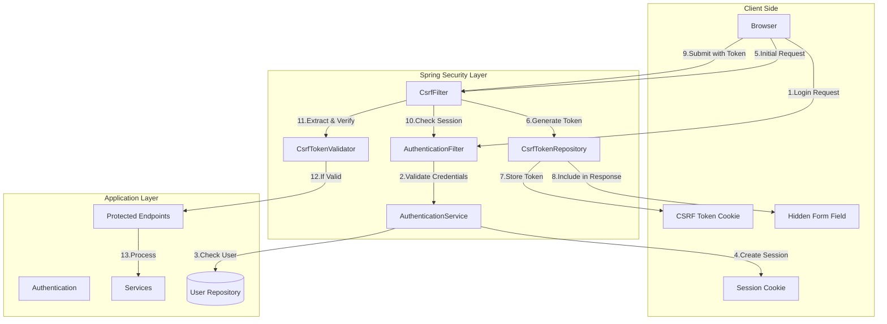
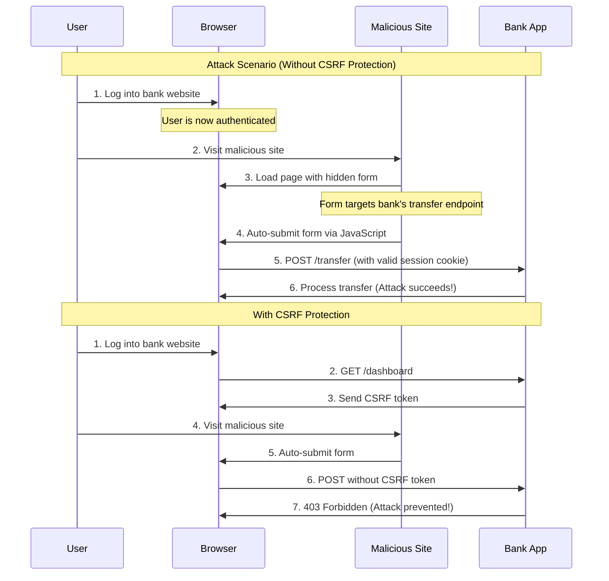
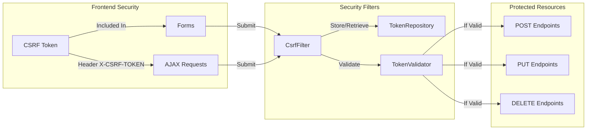
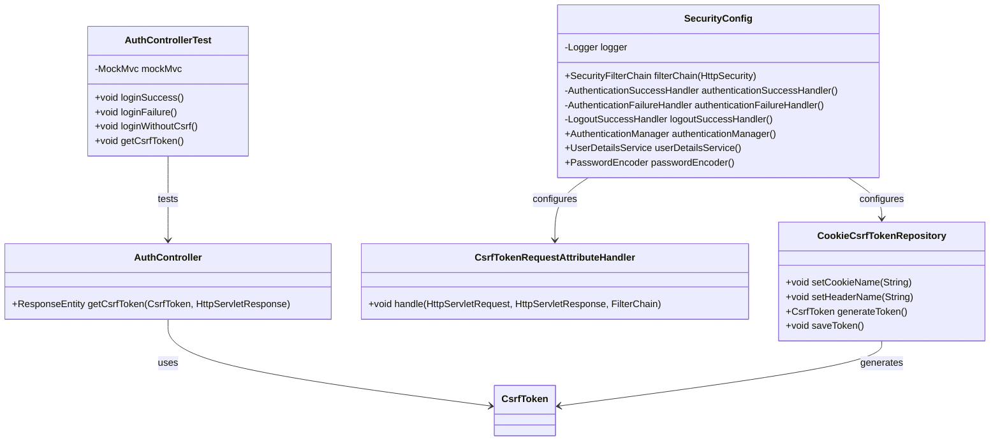

# Cross-Site Request Forgery (CSRF) Protection

## What is CSRF?
Cross-Site Request Forgery (CSRF) is an attack that forces authenticated users to submit unwanted requests to a web application where they're currently logged in. The attack leverages the user's authenticated session to perform unauthorized actions.

## Protection Mechanisms

### 1. Token Generation
* Cryptographically strong random tokens
* Unique per session
* Cannot be predicted by attackers

### 2. Token Storage
* Server-side validation
* Client-side storage in cookies
* Synchronized tokens pattern

### 3. Validation Process
* Token presence check
* Token matching validation
* Session association

## Architecture Overview



## CSRF Attack Scenario



## Implementation Details

### Security Configuration
The application uses Spring Security's CSRF protection with the following configuration:

```java
CsrfTokenRequestAttributeHandler requestHandler = new CsrfTokenRequestAttributeHandler();
CookieCsrfTokenRepository tokenRepository = CookieCsrfTokenRepository.withHttpOnlyFalse();
tokenRepository.setCookieName("XSRF-TOKEN");
tokenRepository.setHeaderName("X-XSRF-TOKEN");
```

Key components:
- `CookieCsrfTokenRepository`: Stores CSRF token in a cookie
- `CsrfTokenRequestAttributeHandler`: Processes CSRF token in requests
- Custom cookie and header names for better integration

### Authentication Flow
1. Client requests CSRF token from `/api/auth/csrf-token`
2. Server generates token and sets cookie
3. Client includes token in subsequent requests
4. Server validates token before processing requests

### API Endpoints

#### GET /api/auth/csrf-token
Retrieves CSRF token and sets cookie

Response:
```json
{
    "token": "your-csrf-token",
    "headerName": "X-XSRF-TOKEN",
    "parameterName": "_csrf"
}
```

#### POST /api/auth/login
Authenticates user with credentials

Request:
```
Content-Type: application/x-www-form-urlencoded
X-XSRF-TOKEN: your-csrf-token

username=user&password=password
```

Success Response:
```json
{
    "status": "success",
    "message": "Login successful"
}
```

### Testing
The application includes comprehensive tests verifying:
- CSRF token generation and cookie setting
- Authentication with valid/invalid credentials
- CSRF protection enforcement
- Token validation

Run tests with: `mvn test`

## Implementation Components



## Class Diagram



## Spring Security Implementation

### 1. Security Configuration
```java
@Configuration
@EnableWebSecurity
public class SecurityConfig {
    @Bean
    public SecurityFilterChain filterChain(HttpSecurity http) {
        return http
            .csrf()
                .csrfTokenRepository(CookieCsrfTokenRepository.withHttpOnlyFalse())
                .and()
            .build();
    }
}
```

### 2. Form Implementation
```html
<form action="/transfer" method="post">
    <input type="hidden" 
           name="${_csrf.parameterName}" 
           value="${_csrf.token}"/>
    <!-- form fields -->
</form>
```

### 3. AJAX Implementation
```javascript
fetch('/api/transfer', {
    method: 'POST',
    headers: {
        'Content-Type': 'application/json',
        'X-CSRF-TOKEN': csrfToken
    },
    body: JSON.stringify(data)
});
```

## Best Practices

### 1. Always Use CSRF Tokens
```java
// ✅ Good: Generate and validate CSRF tokens for all state-changing requests
@PostMapping("/transfer")
public ResponseEntity<?> transfer(@RequestParam String amount) {
    // Spring Security automatically validates CSRF token
    // Process the transfer
}

// ❌ Bad: Skipping CSRF protection
@PostMapping("/transfer")
@CrossOrigin  // Dangerous! Disables CSRF protection
public ResponseEntity<?> transfer(@RequestParam String amount) {
    // Vulnerable to CSRF attacks
}
```

### 2. Secure Token Storage
```javascript
// ✅ Good: Store token in HTTP-only cookie
document.cookie = "XSRF-TOKEN=token123; HttpOnly; Secure; SameSite=Strict";

// ❌ Bad: Storing token in localStorage
localStorage.setItem("csrf-token", "token123");  // Vulnerable to XSS attacks
```

### 3. Token Validation
```java
// ✅ Good: Validate token for all state-changing operations
@Configuration
public class SecurityConfig extends WebSecurityConfigurerAdapter {
    @Override
    protected void configure(HttpSecurity http) {
        http.csrf()
            .csrfTokenRepository(CookieCsrfTokenRepository.withHttpOnlyFalse())
            .requireCsrfProtectionMatcher(request -> 
                // Require CSRF token for POST, PUT, DELETE, PATCH
                !request.getMethod().equals("GET")
            );
    }
}

// ❌ Bad: Disabling CSRF protection globally
@Configuration
public class SecurityConfig extends WebSecurityConfigurerAdapter {
    @Override
    protected void configure(HttpSecurity http) {
        http.csrf().disable();  // Never do this in production!
    }
}
```

### 4. Proper Error Handling
```java
// ✅ Good: Clear error messages for CSRF failures
@ControllerAdvice
public class CsrfExceptionHandler {
    @ExceptionHandler(MissingCsrfTokenException.class)
    public ResponseEntity<?> handleMissingToken() {
        return ResponseEntity
            .status(HttpStatus.FORBIDDEN)
            .body(new ErrorResponse("Missing CSRF token. Please refresh the page."));
    }
}

// ❌ Bad: Generic error messages
@ControllerAdvice
public class CsrfExceptionHandler {
    @ExceptionHandler(Exception.class)
    public ResponseEntity<?> handleAll() {
        return ResponseEntity
            .status(HttpStatus.FORBIDDEN)
            .body("Error");  // Unhelpful message
    }
}
```

## Common Pitfalls and Solutions

### 1. Missing CSRF Token in AJAX Requests
```javascript
// ✅ Good: Include CSRF token in AJAX headers
const token = document.querySelector('meta[name="_csrf"]').content;
fetch('/api/transfer', {
    method: 'POST',
    headers: {
        'X-CSRF-TOKEN': token
    },
    body: JSON.stringify(data)
});

// ❌ Bad: Forgetting CSRF token in AJAX
fetch('/api/transfer', {
    method: 'POST',
    body: JSON.stringify(data)
});  // Request will be rejected
```

### 2. Incorrect Token Handling in Single Page Applications (SPA)
```javascript
// ✅ Good: Fetch and store CSRF token on app initialization
async function initializeApp() {
    // Get initial CSRF token
    const response = await fetch('/api/csrf-token');
    const token = await response.text();
    
    // Set up axios defaults
    axios.defaults.headers.common['X-CSRF-TOKEN'] = token;
}

// ❌ Bad: Using same token indefinitely
// Don't hardcode or reuse tokens
const CSRF_TOKEN = 'static-token';  // Security risk!
```

### 3. Improper Configuration for Different Environments
```java
// ✅ Good: Environment-specific CSRF configuration
@Configuration
@Profile("prod")
public class ProductionSecurityConfig extends WebSecurityConfigurerAdapter {
    @Override
    protected void configure(HttpSecurity http) {
        http.csrf()
            .csrfTokenRepository(CookieCsrfTokenRepository.withHttpOnlyFalse())
            .requireCsrfProtectionMatcher(request -> 
                !request.getMethod().equals("GET")
            );
    }
}

// ❌ Bad: Same configuration for all environments
@Configuration
public class SecurityConfig extends WebSecurityConfigurerAdapter {
    @Override
    protected void configure(HttpSecurity http) {
        // Development settings used in production!
        if (isDevelopment()) {
            http.csrf().disable();
        }
    }
}
```

### 4. Common Troubleshooting Steps

1. **Token Not Found**
   - Check if the token is included in the request headers
   - Verify the token name matches the expected format (e.g., X-CSRF-TOKEN)
   - Ensure the token is not expired

2. **Request Rejected**
   - Confirm the request method requires CSRF protection
   - Verify the token value matches the server-side token
   - Check if the token cookie is present and valid

3. **Configuration Issues**
   - Ensure CSRF protection is enabled in security configuration
   - Verify token repository is properly configured
   - Check if the correct endpoints are protected

4. **Testing Problems**
   - Include CSRF token in test requests
   - Use proper test utilities (e.g., `csrf()` in Spring Security Test)
   - Mock CSRF token generation in unit tests

## Testing Guide

### Functional Tests
```java
@Test
@DisplayName("Should allow request when valid CSRF token is provided")
public void requestWithValidCsrfTokenSucceeds() {
    mockMvc.perform(post("/transfer")
        .with(csrf())                    // Adds valid CSRF token
        .contentType(MediaType.APPLICATION_JSON)
        .content("{\"amount\": 100, \"recipient\": \"john\"}")
    )
    .andExpect(status().isOk())
    .andExpect(jsonPath("$.status").value("success"));
}

@Test
@DisplayName("Should block request when CSRF token is missing")
public void requestWithoutCsrfTokenFails() {
    mockMvc.perform(post("/transfer")    // No CSRF token provided
        .contentType(MediaType.APPLICATION_JSON)
        .content("{\"amount\": 100, \"recipient\": \"john\"}")
    )
    .andExpect(status().isForbidden())
    .andExpect(jsonPath("$.error").value("Missing CSRF token"));
}
```

### Security Tests
```java
@Test
@DisplayName("Should reject request with invalid CSRF token")
public void requestWithInvalidCsrfTokenFails() {
    mockMvc.perform(post("/transfer")
        .header("X-CSRF-TOKEN", "invalid-token")
        .contentType(MediaType.APPLICATION_JSON)
        .content("{\"amount\": 100, \"recipient\": \"john\"}")
    )
    .andExpect(status().isForbidden())
    .andExpect(jsonPath("$.error").value("Invalid CSRF token"));
}

@Test
@DisplayName("Should reject request with expired CSRF token")
public void requestWithExpiredCsrfTokenFails() {
    String expiredToken = generateExpiredToken();
    mockMvc.perform(post("/transfer")
        .header("X-CSRF-TOKEN", expiredToken)
        .contentType(MediaType.APPLICATION_JSON)
        .content("{\"amount\": 100, \"recipient\": \"john\"}")
    )
    .andExpect(status().isForbidden())
    .andExpect(jsonPath("$.error").value("Expired CSRF token"));
}
```

### End-to-End Tests
```java
@Test
@DisplayName("Should complete full transfer flow with CSRF protection")
public void completeTransferFlowWithCsrfProtection() {
    // 1. Get CSRF token from login
    MvcResult loginResult = mockMvc.perform(get("/login"))
        .andExpect(status().isOk())
        .andReturn();
    String csrfToken = extractCsrfToken(loginResult);

    // 2. Perform login
    mockMvc.perform(post("/login")
        .with(csrf().asHeader())
        .param("username", "user")
        .param("password", "password"))
        .andExpect(status().isOk());

    // 3. Perform transfer with token
    mockMvc.perform(post("/transfer")
        .header("X-CSRF-TOKEN", csrfToken)
        .contentType(MediaType.APPLICATION_JSON)
        .content("{\"amount\": 100, \"recipient\": \"john\"}")
    )
    .andExpect(status().isOk())
    .andExpect(jsonPath("$.status").value("success"));
}
```

## Additional Resources

* [Spring Security CSRF Documentation](https://docs.spring.io/spring-security/reference/features/exploits/csrf.html)
* [OWASP CSRF Prevention](https://cheatsheetseries.owasp.org/cheatsheets/Cross-Site_Request_Forgery_Prevention_Cheat_Sheet.html)
* [CSRF Attack Examples](https://owasp.org/www-community/attacks/csrf)

# Cross-Site Request Forgery (CSRF) Protection Demo

## Project Overview
This Spring Boot application demonstrates robust CSRF protection mechanisms using Spring Security's advanced token management.

## Key Security Features

### CSRF Protection Enhancements
- Double Submit Cookie Pattern
- Dynamic CSRF token generation
- Explicit token clearing on logout
- Secure token transmission
- Client-side and server-side token validation

### Authentication Workflow
1. **Token Generation**: 
   - Unique CSRF token generated for each session
   - Stored in `XSRF-TOKEN` cookie
   - Transmitted via custom header `X-XSRF-TOKEN`

2. **Login Process**:
   - REST-based authentication endpoint
   - JSON response for login success/failure
   - Secure password encoding

3. **Logout Mechanism**:
   - Explicit token and session clearing
   - Secure cookie deletion
   - Client-side state management

## Configuration Highlights

### Security Configuration
```java
http.csrf(csrf -> csrf
    .csrfTokenRepository(CookieCsrfTokenRepository.withHttpOnlyFalse())
    .csrfTokenRequestHandler(requestHandler)
    .ignoringRequestMatchers("/api/auth/logout", "/transfer")
)
```

### Key Security Principles
- Prevent cross-site request forgery
- Protect authenticated endpoints
- Validate tokens for all state-changing requests
- Provide clear error handling

## Frontend Implementation
- Dynamic login/logout workflow
- Robust CSRF token management
- Enhanced error logging
- Responsive UI design

## Authentication Details
- **Username**: `user`
- **Password**: `password`
- In-memory user authentication
- Stateless session management

## Running the Application
```bash
# Compile the project
mvn clean compile

# Run the application
mvn spring-boot:run
```

## Testing Scenarios
1. Successful login
2. Protected transfer endpoint
3. Logout with token invalidation
4. Error handling for invalid requests

## Security Recommendations
- Never disable CSRF protection
- Use HTTPS
- Implement additional layers of security
- Regularly update dependencies

## Potential Improvements
- Add multi-factor authentication
- Implement more granular access controls
- Enhanced logging and monitoring
- Comprehensive input validation

## Technologies
- Spring Boot
- Spring Security
- Thymeleaf
- Maven
- Java 17

## License
MIT License

## Disclaimer
This is a demonstration project. Adapt security configurations to your specific requirements.
