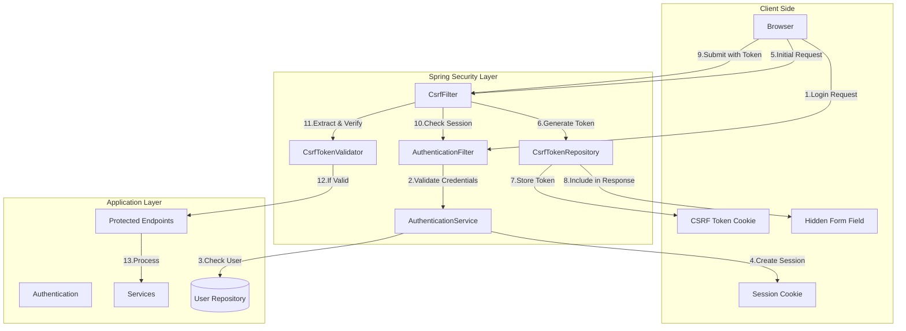
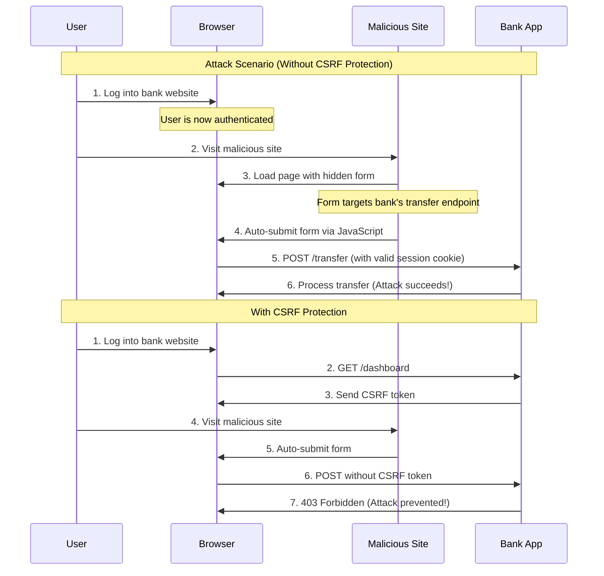
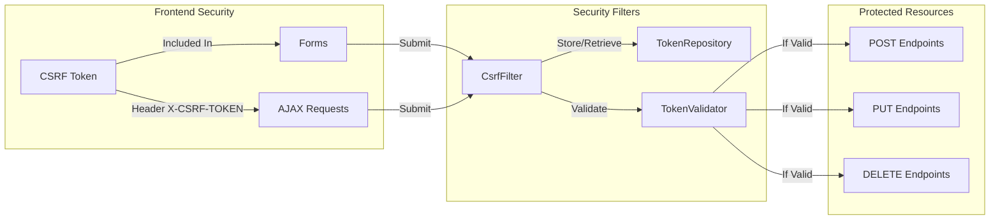
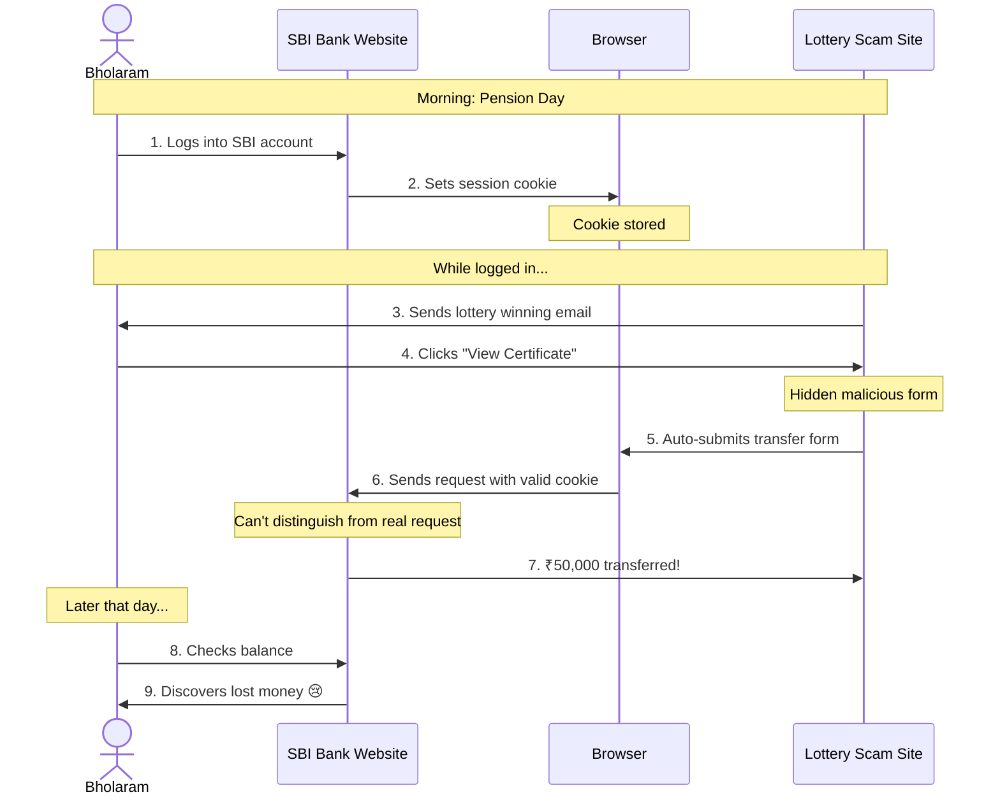
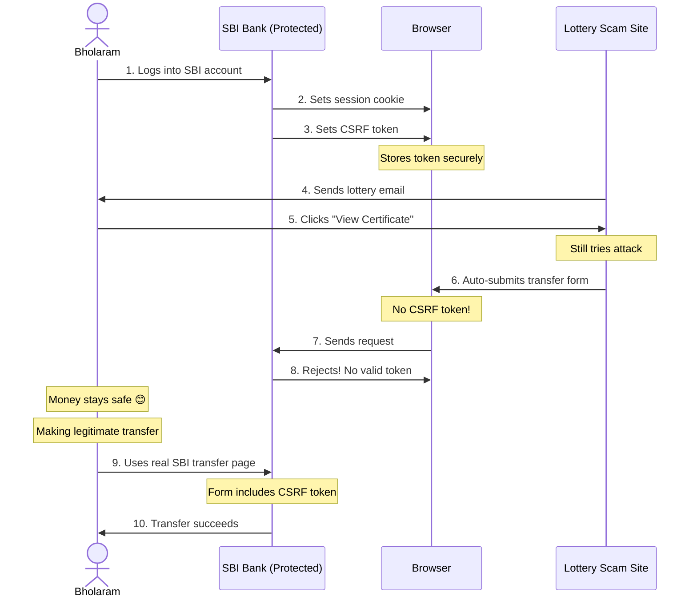

# Cross-Site Request Forgery (CSRF) Protection Tutorial

## Learning Objectives
By the end of this tutorial, you will:
1. Understand CSRF attacks and their impact on web security
2. Learn how to implement CSRF protection in Spring Boot applications
3. Master best practices for token-based security
4. Build a secure money transfer application with CSRF protection

## Understanding CSRF Through a Real-World Analogy

Imagine this scenario:

Bholaram, a retired school teacher, uses State Bank of India's online banking for his pension transactions. One morning, while logged into his bank account, he receives an exciting email: "Congratulations! You've won ₹10,00,000 in the National Lucky Draw! Click here to view your winning certificate!"

The email looks genuine with official-looking logos and stamps. Excited about his luck, Bholaram clicks the link while his bank session is still active.

Unknown to Bholaram, the lottery website is actually malicious. Hidden behind the flashy congratulations page is a script that automatically sends a request to his bank's transfer endpoint:
```html
<form action="https://onlinebanking.sbi/transfer" method="POST" hidden>
    <input type="hidden" name="recipient" value="fraudster-account" />
    <input type="hidden" name="amount" value="50000" />
</form>
<script>document.forms[0].submit();</script>
```

Because Bholaram is still logged into his bank:
1. His browser has a valid session cookie
2. The malicious request includes this cookie automatically
3. The bank's server sees a valid request from Bholaram's authenticated session
4. The transfer of ₹50,000 goes through without his knowledge!

This is a CSRF attack - the attacker tricks Bholaram's browser into making a request he never intended to make. Instead of winning a lottery, he loses his hard-earned pension money!

### How CSRF Protection Helps

With our CSRF protection:
1. When Bholaram logs into his bank, he gets a special CSRF token
2. Every legitimate transfer form on the bank's website includes this token
3. The fake lottery website doesn't have access to this token
4. When the attack tries to transfer money, the bank's server checks for the token
5. No valid token = no transfer = Bholaram's money stays safe!

Think of it like this: The CSRF token is like an Aadhaar-based verification. Anyone can write a letter in Bholaram's name, but only he can provide his unique Aadhaar biometric verification to prove it's genuinely him making the transaction.

Now that you understand the problem, let's learn how to implement this protection in your own applications!

## Prerequisites
- Basic knowledge of Spring Boot
- Understanding of web security concepts
- Java development environment setup
- Maven installed
- IDE (preferably IntelliJ IDEA or Eclipse)

## Project Context
Imagine you're building a banking application where users can transfer money. Without proper CSRF protection, attackers could trick users into making unauthorized transfers. This tutorial demonstrates how to prevent such attacks.

## Step-by-Step Implementation Guide

### Step 1: Project Setup
1. Create a new Spring Boot project:
   ```bash
   mvn archetype:generate \
     -DgroupId=com.example.csrf \
     -DartifactId=csrf-protection \
     -DarchetypeArtifactId=maven-archetype-quickstart \
     -DinteractiveMode=false
   ```

2. Add dependencies to `pom.xml`:
   ```xml
   <dependencies>
       <dependency>
           <groupId>org.springframework.boot</groupId>
           <artifactId>spring-boot-starter-web</artifactId>
       </dependency>
       <dependency>
           <groupId>org.springframework.boot</groupId>
           <artifactId>spring-boot-starter-security</artifactId>
       </dependency>
       <dependency>
           <groupId>org.springframework.boot</groupId>
           <artifactId>spring-boot-starter-thymeleaf</artifactId>
       </dependency>
   </dependencies>
   ```

### Step 2: Configure Security
1. Create `SecurityConfig.java`:
   ```java
   @Configuration
   @EnableWebSecurity
   public class SecurityConfig {
       @Bean
       public SecurityFilterChain filterChain(HttpSecurity http) {
           // Configure CSRF token handler
           CsrfTokenRequestAttributeHandler requestHandler = new CsrfTokenRequestAttributeHandler();
           requestHandler.setCsrfRequestAttributeName("_csrf");

           // Configure token repository
           CookieCsrfTokenRepository tokenRepository = CookieCsrfTokenRepository.withHttpOnlyFalse();
           tokenRepository.setCookieName("XSRF-TOKEN");
           tokenRepository.setHeaderName("X-XSRF-TOKEN");

           return http
               .csrf(csrf -> csrf
                   .csrfTokenRepository(tokenRepository)
                   .csrfTokenRequestHandler(requestHandler))
               // ... other security configurations
               .build();
       }
   }
   ```

### Step 3: Create Frontend Interface
1. Create `index.html`:
   ```html
   <!DOCTYPE html>
   <html xmlns:th="http://www.thymeleaf.org">
   <head>
       <title>Secure Money Transfer</title>
   </head>
   <body>
       <!-- Login Form -->
       <form id="loginForm">
           <input type="text" name="username" />
           <input type="password" name="password" />
           <button type="submit">Login</button>
       </form>

       <!-- Transfer Form -->
       <form id="transferForm">
           <input type="text" name="recipient" />
           <input type="number" name="amount" />
           <button type="submit">Transfer</button>
       </form>

       <script>
           // CSRF token handling
           let csrfToken;
           
           // Fetch CSRF token
           async function fetchCsrfToken() {
               const response = await fetch('/api/auth/csrf-token');
               csrfToken = await response.json();
           }
           
           // Initialize on page load
           fetchCsrfToken();
       </script>
   </body>
   </html>
   ```

### Step 4: Implement Controllers
1. Create `AuthController.java`:
   ```java
   @RestController
   @RequestMapping("/api/auth")
   public class AuthController {
       @GetMapping("/csrf-token")
       public CsrfToken getCsrfToken(CsrfToken token) {
           return token;
       }
   }
   ```

2. Create `TransferController.java`:
   ```java
   @RestController
   public class TransferController {
       @PostMapping("/transfer")
       public ResponseEntity<?> transfer(@RequestParam String recipient, 
                                       @RequestParam BigDecimal amount) {
           // Transfer logic here
           return ResponseEntity.ok().build();
       }
   }
   ```

### Step 5: Testing Your Implementation
1. Run the application:
   ```bash
   mvn spring-boot:run
   ```

2. Test CSRF protection:
   - Log in with username: "user", password: "password"
   - Try making a transfer
   - Verify CSRF token in browser dev tools
   - Attempt transfer without token (should fail)

## System Architecture

### Component Overview


### Attack Prevention Workflow


### Security Components


## Common Pitfalls and Solutions

### 1. Token Not Being Sent
Problem: CSRF token not included in requests
Solution: Ensure proper token extraction and inclusion in headers:
```javascript
fetch('/transfer', {
    method: 'POST',
    headers: {
        [csrfToken.headerName]: csrfToken.token
    }
});
```

### 2. Token Validation Failures
Problem: Server rejecting valid tokens
Solution: Check token configuration:
```java
tokenRepository.setCookieName("XSRF-TOKEN");
tokenRepository.setHeaderName("X-XSRF-TOKEN");
```

## Best Practices Checklist
- [ ] Use HTTPS in production
- [ ] Implement proper error handling
- [ ] Clear tokens on logout
- [ ] Use secure cookie settings
- [ ] Implement request logging
- [ ] Add comprehensive testing

## Troubleshooting Guide
1. **403 Forbidden Error**
   - Check if CSRF token is present in request
   - Verify token header name matches configuration
   - Ensure token hasn't expired

2. **Token Not Generated**
   - Verify security configuration
   - Check if token endpoint is accessible
   - Confirm cookie settings

## Learning Resources
1. **Official Documentation**
   - [Spring Security Reference](https://docs.spring.io/spring-security/reference/)
   - [OWASP CSRF Guide](https://owasp.org/www-community/attacks/csrf)

2. **Additional Reading**
   - [Understanding CSRF Attacks](https://portswigger.net/web-security/csrf)
   - [Token-Based Authentication](https://auth0.com/learn/token-based-authentication-made-easy/)

## Next Steps
1. Add more security features:
   - Rate limiting
   - Input validation
   - Audit logging

2. Enhance the application:
   - Add user management
   - Implement transaction history
   - Add email notifications

## Support
- Create an issue in the GitHub repository
- Join our community discussions
- Check the FAQ section

## Contributing
We welcome contributions! Please:
1. Fork the repository
2. Create a feature branch
3. Submit a pull request

## License
MIT License - Feel free to use this code for learning and development

### The Attack Scenario Visualized


### With CSRF Protection


The diagrams above illustrate how:
1. The scammer exploits Bholaram's active session in the first scenario
2. CSRF protection blocks the fraudulent transfer in the second scenario
3. Only legitimate transfers from SBI's website succeed

This visual representation helps understand why CSRF tokens are crucial for protecting users like Bholaram from such attacks.

Remember: Security is a continuous process. Stay updated with the latest security practices and regularly review your implementation.
