# Cross-Site Request Forgery (CSRF) Protection Tutorial

## Learning Objectives
By the end of this tutorial, you will:
1. Understand CSRF attacks and their impact on web security
2. Learn how to implement CSRF protection in Spring Boot applications
3. Master best practices for token-based security
4. Build a secure money transfer application with CSRF protection

## Understanding CSRF Through a Real-World Analogy

Imagine this scenario:

Bholaram, a retired school teacher, uses State Bank of India's online banking for his pension transactions. One morning, while logged into his bank account, he receives an exciting email: "Congratulations! You've won ₹10,00,000 in the National Lucky Draw! Click here to view your winning certificate!"

The email looks genuine with official-looking logos and stamps. Excited about his luck, Bholaram clicks the link while his bank session is still active.

Unknown to Bholaram, the lottery website is actually malicious. Hidden behind the flashy congratulations page is a script that automatically sends a request to his bank's transfer endpoint:
```html
<form action="https://onlinebanking.sbi/transfer" method="POST" hidden>
    <input type="hidden" name="recipient" value="fraudster-account" />
    <input type="hidden" name="amount" value="50000" />
</form>
<script>document.forms[0].submit();</script>
```

Because Bholaram is still logged into his bank:
1. His browser has a valid session cookie
2. The malicious request includes this cookie automatically
3. The bank's server sees a valid request from Bholaram's authenticated session
4. The transfer of ₹50,000 goes through without his knowledge!

This is a CSRF attack - the attacker tricks Bholaram's browser into making a request he never intended to make. Instead of winning a lottery, he loses his hard-earned pension money!

### How CSRF Protection Helps

With our CSRF protection:
1. When Bholaram logs into his bank, he gets a special CSRF token
2. Every legitimate transfer form on the bank's website includes this token
3. The fake lottery website doesn't have access to this token
4. When the attack tries to transfer money, the bank's server checks for the token
5. No valid token = no transfer = Bholaram's money stays safe!

### Why CSRF Tokens Are Crucial

CSRF tokens are essential for ensuring that every action taken on a website is initiated by the user, not by a third-party site attempting to exploit an active session. Here's how they work:

- **Same-Origin Policy**: Browsers enforce this policy to prevent malicious sites from accessing sensitive information like CSRF tokens and cookies from another site.

- **Session Context**: CSRF tokens are tied to a user's session, ensuring that even if a token is copied within the same site, it only works if the session is valid.

- **User Intent**: By requiring a CSRF token for state-changing actions, the server can verify that the request was made intentionally by the user, not by a third-party site.

Think of it like this: The CSRF token is like an Aadhaar-based verification. While anyone can write a letter in Bholaram's name, only he can provide his unique Aadhaar biometric verification to prove it's genuinely him making the transaction.

In summary, CSRF tokens help maintain the integrity of user actions by ensuring they are performed with the user's consent and within a secure session context. Now that you understand the problem, let's learn how to implement this protection in your own applications!

### The Attack Scenario Visualized

```mermaid
sequenceDiagram
    actor B as Bholaram
    participant SBI as SBI Bank Website
    participant Browser
    participant Scammer as Lottery Scam Site
    
    Note over B,Scammer: Morning: Pension Day
    B->>SBI: 1. Logs into SBI account
    SBI->>Browser: 2. Sets session cookie
    Note over Browser: Cookie stored
    
    Note over B,Scammer: While logged in...
    Scammer->>B: 3. Sends lottery winning email
    B->>Scammer: 4. Clicks "View Certificate"
    
    Note over Scammer: Hidden malicious form
    Scammer->>Browser: 5. Auto-submits transfer form
    Browser->>SBI: 6. Sends request with valid cookie
    Note over SBI: Can't distinguish from real request
    SBI->>Scammer: 7. ₹50,000 transferred!
    
    Note over B: Later that day...
    B->>SBI: 8. Checks balance
    SBI->>B: 9. Discovers lost money 😢

```


### With CSRF Protection


The diagrams above illustrate how:
1. The scammer exploits Bholaram's active session in the first scenario
2. CSRF protection blocks the fraudulent transfer in the second scenario
3. Only legitimate transfers from SBI's website succeed

This visual representation helps understand why CSRF tokens are crucial for protecting users like Bholaram from such attacks.

## Prerequisites
- Basic knowledge of Spring Boot
- Understanding of web security concepts
- Java development environment setup
- Maven installed
- IDE (preferably IntelliJ IDEA or Eclipse)

## Project Structure
```
csrf-protection/
├── src/
│   ├── main/
│   │   ├── java/
│   │   │   └── com/
│   │   │       └── example/
│   │   │           └── csrf/
│   │   │               ├── CsrfProtectionApplication.java
│   │   │               ├── config/
│   │   │               │   └── SecurityConfig.java
│   │   │               ├── controller/
│   │   │               │   ├── AuthController.java
│   │   │               │   └── TransferController.java
│   │   │               ├── model/
│   │   │               │   └── TransferRequest.java
│   │   │               └── service/
│   │   │                   └── TransferService.java
│   │   └── resources/
│   │       ├── static/
│   │       │   ├── css/
│   │       │   │   └── styles.css
│   │       │   └── js/
│   │       │       └── main.js
│   │       └── templates/
│   │           └── index.html
│   └── test/
│       └── java/
│           └── com/
│               └── example/
│                   └── csrf/
│                       └── CsrfProtectionTests.java
├── pom.xml
├── README.md
├── attack_scenario.mmd
└── csrf_protection.mmd
```

## Project Context
Imagine you're building a banking application where users can transfer money. Without proper CSRF protection, attackers could trick users into making unauthorized transfers. This tutorial demonstrates how to prevent such attacks.

## Step-by-Step Implementation Guide

### Step 1: Project Setup
1. Create a new Spring Boot project:
   ```bash
   mvn archetype:generate \
     -DgroupId=com.example.csrf \
     -DartifactId=csrf-protection \
     -DarchetypeArtifactId=maven-archetype-quickstart \
     -DinteractiveMode=false
   ```

2. Add dependencies to `pom.xml`:
   ```xml
   <dependencies>
       <dependency>
           <groupId>org.springframework.boot</groupId>
           <artifactId>spring-boot-starter-web</artifactId>
       </dependency>
       <dependency>
           <groupId>org.springframework.boot</groupId>
           <artifactId>spring-boot-starter-security</artifactId>
       </dependency>
       <dependency>
           <groupId>org.springframework.boot</groupId>
           <artifactId>spring-boot-starter-thymeleaf</artifactId>
       </dependency>
   </dependencies>
   ```

### Step 2: Configure Security
1. Create `SecurityConfig.java`:
   ```java
   @Configuration
   @EnableWebSecurity
   public class SecurityConfig {
       @Bean
       public SecurityFilterChain filterChain(HttpSecurity http) {
           // Configure CSRF token handler
           CsrfTokenRequestAttributeHandler requestHandler = new CsrfTokenRequestAttributeHandler();
           requestHandler.setCsrfRequestAttributeName("_csrf");

           // Configure token repository
           CookieCsrfTokenRepository tokenRepository = CookieCsrfTokenRepository.withHttpOnlyFalse();
           tokenRepository.setCookieName("XSRF-TOKEN");
           tokenRepository.setHeaderName("X-XSRF-TOKEN");

           return http
               .csrf(csrf -> csrf
                   .csrfTokenRepository(tokenRepository)
                   .csrfTokenRequestHandler(requestHandler))
               // ... other security configurations
               .build();
       }
   }
   ```

### Understanding SecurityFilterChain

In Spring Security, the `SecurityFilterChain` is a core component that defines the security filters applied to incoming requests. Here's how it fits into the Spring lifecycle:

1. **Filter Configuration**: The `SecurityFilterChain` is configured in your security configuration class, typically annotated with `@Configuration` and `@EnableWebSecurity`. It specifies the order and configuration of security filters.

2. **Filter Execution**: When a request is received, Spring Security uses the `SecurityFilterChain` to determine which filters should be applied. Filters are executed in the order they are defined.

3. **Lifecycle Integration**: During the Spring application startup, the `SecurityFilterChain` is initialized and integrated into the filter chain of the servlet container (e.g., Tomcat). This ensures that all incoming requests pass through the configured security filters.

4. **Customization**: You can customize the `SecurityFilterChain` to include various filters, such as authentication, authorization, CSRF protection, and more. This allows you to tailor security measures to your application's needs.

By understanding the role of `SecurityFilterChain`, you can effectively manage and customize the security behavior of your Spring Boot application, ensuring that requests are processed securely and according to your defined rules.

### Step 3: Create Frontend Interface
1. Create `index.html`:
   ```html
   <!DOCTYPE html>
   <html xmlns:th="http://www.thymeleaf.org">
   <head>
       <title>Secure Money Transfer</title>
   </head>
   <body>
       <!-- Login Form -->
       <form id="loginForm">
           <input type="text" name="username" />
           <input type="password" name="password" />
           <button type="submit">Login</button>
       </form>

       <!-- Transfer Form -->
       <form id="transferForm">
           <input type="text" name="recipient" />
           <input type="number" name="amount" />
           <button type="submit">Transfer</button>
       </form>

       <script>
           // CSRF token handling
           let csrfToken;
           
           // Fetch CSRF token
           async function fetchCsrfToken() {
               const response = await fetch('/api/auth/csrf-token');
               csrfToken = await response.json();
           }
           
           // Initialize on page load
           fetchCsrfToken();
       </script>
   </body>
   </html>
   ```

### Step 4: Implement Controllers
1. Create `AuthController.java`:
   ```java
   @RestController
   @RequestMapping("/api/auth")
   public class AuthController {
       @GetMapping("/csrf-token")
       public CsrfToken getCsrfToken(CsrfToken token) {
           return token;
       }

       @PostMapping("/login")
       public ResponseEntity<?> login(@RequestBody LoginRequest request) {
           try {
               // Create authentication token
               UsernamePasswordAuthenticationToken authToken = 
                   new UsernamePasswordAuthenticationToken(request.getUsername(), request.getPassword());
               
               // Authenticate user
               Authentication authentication = 
                   authenticationManager.authenticate(authToken);
               
               // Set authentication in security context
               SecurityContextHolder.getContext()
                   .setAuthentication(authentication);
               
               return ResponseEntity.ok()
                   .body(Map.of("status", "success", "message", "Login successful"));
           } catch (AuthenticationException e) {
               return ResponseEntity.status(HttpStatus.UNAUTHORIZED)
                   .body(Map.of("status", "error", "message", "Invalid credentials"));
           }
       }

       @PostMapping("/logout")
       public ResponseEntity<?> logout(HttpServletRequest request, 
                                     HttpServletResponse response) {
           // Get authentication
           Authentication auth = SecurityContextHolder.getContext()
               .getAuthentication();
           
           if (auth != null) {
               // Perform logout
               new SecurityContextLogoutHandler()
                   .logout(request, response, auth);
               
               // Clear CSRF token cookie
               Cookie csrfCookie = new Cookie("XSRF-TOKEN", null);
               csrfCookie.setMaxAge(0);
               csrfCookie.setPath("/");
               response.addCookie(csrfCookie);
           }
           
           return ResponseEntity.ok()
               .body(Map.of("status", "success", "message", "Logout successful"));
       }
   }
   ```

2. Create `TransferController.java`:
   ```java
   @RestController
   @RequestMapping("/api/transfer")
   public class TransferController {
       private final TransferService transferService;
       
       public TransferController(TransferService transferService) {
           this.transferService = transferService;
       }
       
       @PostMapping
       public ResponseEntity<?> transfer(@RequestBody TransferRequest request) {
           try {
               // Get current authenticated user
               Authentication auth = SecurityContextHolder.getContext()
                   .getAuthentication();
               String username = auth.getName();
               
               // Perform transfer
               TransferResult result = transferService.transfer(
                   username,
                   request.getRecipient(),
                   request.getAmount()
               );
               
               return ResponseEntity.ok()
                   .body(Map.of(
                       "status", "success",
                       "message", "Transfer successful",
                       "transactionId", result.getTransactionId()
                   ));
           } catch (InsufficientFundsException e) {
               return ResponseEntity.badRequest()
                   .body(Map.of("status", "error", "message", "Insufficient funds"));
           } catch (Exception e) {
               return ResponseEntity.status(HttpStatus.INTERNAL_SERVER_ERROR)
                   .body(Map.of("status", "error", "message", "Transfer failed"));
           }
       }
   }
   ```

3. Update frontend JavaScript to handle authentication and transfers:
   ```javascript
   // Authentication and CSRF token management
   class SecurityManager {
       static async fetchCsrfToken() {
           const response = await fetch('/api/auth/csrf-token');
           const token = await response.json();
           return token;
       }
       
       static async login(username, password) {
           const token = await this.fetchCsrfToken();
           const response = await fetch('/api/auth/login', {
               method: 'POST',
               headers: {
                   'Content-Type': 'application/json',
                   [token.headerName]: token.token
               },
               body: JSON.stringify({ username, password })
           });
           return response.json();
       }
       
       static async logout() {
           const token = await this.fetchCsrfToken();
           const response = await fetch('/api/auth/logout', {
               method: 'POST',
               headers: {
                   [token.headerName]: token.token
               }
           });
           return response.json();
       }
   }

   // Transfer management
   class TransferManager {
       static async transfer(recipient, amount) {
           const token = await SecurityManager.fetchCsrfToken();
           const response = await fetch('/api/transfer', {
               method: 'POST',
               headers: {
                   'Content-Type': 'application/json',
                   [token.headerName]: token.token
               },
               body: JSON.stringify({ recipient, amount })
           });
           return response.json();
       }
   }

   // Event handlers
   document.getElementById('loginForm').addEventListener('submit', async (e) => {
       e.preventDefault();
       const username = document.getElementById('username').value;
       const password = document.getElementById('password').value;
       
       try {
           const result = await SecurityManager.login(username, password);
           if (result.status === 'success') {
               updateUI('logged-in');
               showMessage('Login successful', 'success');
           } else {
               showMessage(result.message, 'error');
           }
       } catch (error) {
           showMessage('Login failed', 'error');
       }
   });

   document.getElementById('logoutButton').addEventListener('click', async () => {
       try {
           const result = await SecurityManager.logout();
           if (result.status === 'success') {
               updateUI('logged-out');
               showMessage('Logout successful', 'success');
           }
       } catch (error) {
           showMessage('Logout failed', 'error');
       }
   });

   document.getElementById('transferForm').addEventListener('submit', async (e) => {
       e.preventDefault();
       const recipient = document.getElementById('recipient').value;
       const amount = document.getElementById('amount').value;
       
       try {
           const result = await TransferManager.transfer(recipient, amount);
           if (result.status === 'success') {
               showMessage(`Transfer successful. Transaction ID: ${result.transactionId}`, 'success');
               document.getElementById('transferForm').reset();
           } else {
               showMessage(result.message, 'error');
           }
       } catch (error) {
           showMessage('Transfer failed', 'error');
       }
   });

   // UI helper functions
   function updateUI(state) {
       document.body.className = `container mt-5 ${state}`;
   }

   function showMessage(message, type) {
       const alertDiv = document.createElement('div');
       alertDiv.className = `alert alert-${type === 'success' ? 'success' : 'danger'} mt-3`;
       alertDiv.textContent = message;
       
       const container = document.querySelector('.container');
       container.insertBefore(alertDiv, container.firstChild);
       
       setTimeout(() => alertDiv.remove(), 5000);
   }
   ```

### Step 5: Testing Your Implementation
1. Run the application:
   ```bash
   mvn spring-boot:run
   ```

2. Test CSRF protection:
   - Log in with username: "user", password: "password"
   - Try making a transfer
   - Verify CSRF token in browser dev tools
   - Attempt transfer without token (should fail)

## System Architecture

### Component Overview


### Attack Prevention Workflow


### Security Components


## GitHub Repository

You can find the complete source code for this project on GitHub: [CSRF Protection Demo](https://github.com/sankarpadhy/securitypatterns). The repository includes:
- Detailed documentation
- Source code for the Spring Boot application
- Configuration files for security settings
- Example HTML templates

### API Overview

The application includes several APIs, each implemented with CSRF protection in mind:

- **Login API**: Handles user authentication. Upon successful login, a CSRF token is generated and sent to the client to be included in subsequent requests.

- **Logout API**: Invalidates the user session and CSRF token, ensuring that any further requests require re-authentication.

- **Transfer API**: A protected endpoint that requires a valid CSRF token for money transfer requests. This ensures that only legitimate requests from authenticated users are processed.

- **CSRF Token Retrieval**: Provides an endpoint for retrieving the CSRF token, allowing the client to include it in state-changing requests.

These APIs demonstrate how to integrate CSRF protection into various aspects of a web application, ensuring secure interactions between the client and server.

## Mitigating Potential Breaches

While CSRF tokens provide robust protection, it's essential to implement additional security measures to mitigate potential breaches:

1. **Regular Audits**: Conduct regular security audits and penetration testing to identify and fix vulnerabilities.

2. **Cross-Site Scripting (XSS) Prevention**: Implement Content Security Policy (CSP) and sanitize user inputs to prevent XSS attacks that could expose CSRF tokens.

3. **Secure Token Handling**: Ensure CSRF tokens are not included in URLs or exposed in referrer headers. Use secure cookies for token storage.

4. **Session Security**: Protect session cookies with Secure and HttpOnly flags, and use HTTPS to encrypt data in transit.

5. **Multi-Factor Authentication (MFA)**: Implement MFA to add an extra layer of security, making it harder for attackers to hijack sessions.

By combining CSRF protection with these additional measures, you can significantly reduce the risk of unauthorized actions and enhance the overall security of your application.

## Common Pitfalls and Solutions

### 1. Token Not Being Sent
Problem: CSRF token not included in requests
Solution: Ensure proper token extraction and inclusion in headers:
```javascript
fetch('/transfer', {
    method: 'POST',
    headers: {
        [csrfToken.headerName]: csrfToken.token
    }
});
```

### 2. Token Validation Failures
Problem: Server rejecting valid tokens
Solution: Check token configuration:
```java
tokenRepository.setCookieName("XSRF-TOKEN");
tokenRepository.setHeaderName("X-XSRF-TOKEN");
```

## Best Practices Checklist
- [ ] Use HTTPS in production
- [ ] Implement proper error handling
- [ ] Clear tokens on logout
- [ ] Use secure cookie settings
- [ ] Implement request logging
- [ ] Add comprehensive testing

## Troubleshooting Guide
1. **403 Forbidden Error**
   - Check if CSRF token is present in request
   - Verify token header name matches configuration
   - Ensure token hasn't expired

2. **Token Not Generated**
   - Verify security configuration
   - Check if token endpoint is accessible
   - Confirm cookie settings

## Learning Resources
1. **Official Documentation**
   - [Spring Security Reference](https://docs.spring.io/spring-security/reference/)
   - [OWASP CSRF Guide](https://owasp.org/www-community/attacks/csrf)

2. **Additional Reading**
   - [Understanding CSRF Attacks](https://portswigger.net/web-security/csrf)
   - [Token-Based Authentication](https://auth0.com/learn/token-based-authentication-made-easy/)

## Next Steps
1. Add more security features:
   - Rate limiting
   - Input validation
   - Audit logging

2. Enhance the application:
   - Add user management
   - Implement transaction history
   - Add email notifications

## Support
- Create an issue in the GitHub repository
- Join our community discussions
- Check the FAQ section

## Contributing
We welcome contributions! Please:
1. Fork the repository
2. Create a feature branch
3. Submit a pull request

## License
MIT License - Feel free to use this code for learning and development


Remember: Security is a continuous process. Stay updated with the latest security practices and regularly review your implementation.
